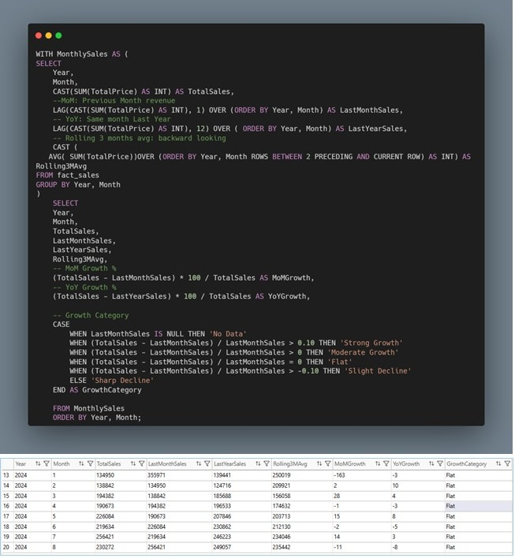

# 🛒 Grocery Retail Analytics: 
## Customer Intelligence & Price Optimization System
### Data‑Driven Segmentation • Price Elasticity • Automated ETL • Power BI Insights

## Table of Contents
- [Executive Summary](#executive-summary)
- [Dataset Summary](#dataset-summary)
- [Business Problem, Objectives & Scope](#business-problem-objectives--scope)
- [Analytics & Insights](#analytics--insights)
- [Hypothesis Testing](#hypothesis-testing)
- [Recommendation](#recommendation)

## Executive Summary
This project shows how data can help a grocery store understand its customers better and make smarter decisions about products and pricing. I built a three‑dimensional customer segmentation model using RFM, profitability, and price sensitivity to see who shops most often, who brings the most value, and who responds well to promotions. I also analysed product performance across the store, including sales, margins, buying patterns, market basket behaviour, and optimal pricing. Together, these insights highlight which customers matter most, which products drive value, and where pricing changes can boost both revenue and footfall. One clear example is **Raisin Muffins**: treating them as a flagship product and investing in their price can increase visits and basket size. Combined with better inventory planning, stronger retention, and targeted win‑back strategies, the store can grow revenue more effectively.

## Dataset Summary
This grocery store dataset contains multiple linked tables covering sales, customers, products, and employees from Jan 2023 to Dec 2024. 

## Business Problem, Objectives & Scope
### Business Problem
Grocery retailer often struggle to make data-driven decisions about customer retention, product strategy, and pricing. Without a clear understanding of customer behaviour, sentiment, and product performance, the business faces challenges such as:

-	Rising churn with limited visibility into which customers are at risk

-	Difficulty identifying high-value customer segments for targeted campaigns

-	Unclear product contribution patterns, making assortment and pricing decisions less effective

These gaps reduce the effectiveness of marketing, pricing, and product decisions, ultimately impacting revenue and customer loyalty.

## Project Objectives
The objective of this project is to build a customer‑intelligence framework that enables the business to:

-	Reduce customer **churn by 5% within 12 months** through early‑warning indicators and segment‑specific insights

-	Identify **high‑value and high‑risk customer segments** using behavioural, transactional, and sentiment‑based metrics

-	Improve **product performance visibility** through contribution analysis, ABC classification, and Pareto insights

-	Optimise **inventory planning** by prioritising high-impact products to ensure consistent availability and efficient stock allocation

-	Support pricing and promotion decisions by identifying price‑sensitive segments and high‑elasticity products

The goal is to provide actionable insights that improve retention, profitability, and decision‑making across marketing, product, and operations.

## Tech Stack

**Python** — Used for data cleaning, transformation, and ensuring data integrity

**SQL** — Used to perform exploratory analysis and extract key behavioural and transactional insights

**Power BI** — Used to visualise customer segments, product performance, and pricing insights in an interactive dashboard

## Analytics & Insights

### Monthly Sales Trend</h2>

### High‑value and high‑risk customer segments 

Across all customer segments, Premium Bargain Hunter, Value Conscious VIP, and High Value Promo Churn Risk customers represent only 32% of the total customer base, yet they generate an exceptional 98% of total company profit.
This confirms a strong Pareto effect: a small group of high value customers drives nearly all profitability.

### Reduce customer churn by 5% within 12 months 

### 📉 Monthly Retention Rate

#### Churn At Risk Customer List

#### Churn Win-Back Customer List

Monthly retention currently fluctuates around **50%**, meaning that half of customers do not return the following month. This highlights a significant opportunity to stabilise loyalty and reduce churn.
Within the top three high value customer segments, two priority groups emerge:

- **Churn At Risk (Recency 31–60 days):**
Customers who have not purchased in over a month but remain within a recoverable window.
This segment currently includes four high value customers who require targeted engagement to prevent full churn.

- **Churn	Win Back (Recency ≤ 30 days):**
High value customers who have recently lapsed and are most responsive to reactivation efforts.
These customers represent the quickest opportunity to lift retention and reduce churn.

Together, these insights provide a clear roadmap for targeted interventions that can meaningfully contribute to the goal of reducing churn by 5% within 12 months.

### Product Performance 

#### Product Category Performance

Category level Pareto analysis shows that revenue is highly concentrated: Seafood and Household & Misc together generate more than 71% of total sales, making them the core categories that drive overall business performance. Fruits & Vegetables serves as a mid tier support category, contributing high volume but only moderate revenue.
This distribution highlights three strategic priorities:
-	**Protect core categories** through strong stock availability, pricing control, and supplier reliability
-	**Leverage high volume support categories** like Fruits & Vegetables to drive cross sell and basket expansion
-	**Rationalise low impact categories** to optimise inventory, reduce carrying costs, and improve overall profitability

#### Product Performance: Order by SALES Contribution

Product performance analysis ordered by sales contribution reveals a highly concentrated revenue structure. A tier products account for the majority of total sales and represent the core assortment that drives business performance. B tier products provide essential support by increasing basket size and enabling cross sell opportunities. C tier products contribute minimally and represent candidates for SKU rationalisation. This ABC classification provides a clear roadmap for inventory optimisation, pricing strategy, and promotional prioritisation.

