

# 🛒 Grocery Retail Analytics: 
## Customer Intelligence & Price Optimization System
### Data‑Driven Segmentation • Price Elasticity • Automated ETL • Power BI Insights

## Table of Contents
- [Executive Summary](#executive-summary)
- [Dataset Summary](#dataset-summary)
- [Business Problem, Objectives & Scope](#business-problem-objectives--scope)
- [Analytics & Insights](#analytics--insights)
- [Recommendation](#recommendation)
- [How to Reproduce](#how-to-reproduce)
- [Limitations and Next Steps](#limitations-and-next-steps)

## 1. Executive Summary
This project shows how data can help a grocery store understand its customers better and make smarter decisions about products and pricing. I built a three‑dimensional customer segmentation model using RFM, profitability, and price sensitivity to see who shops most often, who brings the most value, and who responds well to promotions. I also analysed product performance across the store, including sales, margins, buying patterns, market basket behaviour, and optimal pricing. Together, these insights highlight which customers matter most, which products drive value, and where pricing changes can boost both revenue and footfall. One clear example is **Raisin Muffins**: treating them as a flagship product and investing in their price can increase visits and basket size. Combined with better inventory planning, stronger retention, and targeted win‑back strategies, the store can grow revenue more effectively.

## 2. Dataset Summary
This grocery store dataset contains multiple linked tables covering sales, customers, products, and employees from Jan 2023 to Dec 2024. 

## 3. Business Problem, Objectives & Scope
### Business Problem
Grocery retailer often struggle to make data-driven decisions about customer retention, product strategy, and pricing. Without a clear understanding of customer behaviour, sentiment, and product performance, the business faces challenges such as:

-	Rising churn with limited visibility into which customers are at risk

-	Difficulty identifying high-value customer segments for targeted campaigns

-	Unclear product contribution patterns, making assortment and pricing decisions less effective

These gaps reduce the effectiveness of marketing, pricing, and product decisions, ultimately impacting revenue and customer loyalty.

## Project Objectives
The objective of this project is to build a customer‑intelligence framework that enables the business to:

-	Reduce customer **churn by 5% within 12 months** through early‑warning indicators and segment‑specific insights

-	Identify **high‑value and high‑risk customer segments** using behavioural, transactional, and sentiment‑based metrics

-	Improve **product performance visibility** through contribution analysis, ABC classification, and Pareto insights

-	Optimise **inventory planning** by prioritising high-impact products to ensure consistent availability and efficient stock allocation

-	Support pricing and promotion decisions by identifying price‑sensitive segments and high‑elasticity products

The goal is to provide actionable insights that improve retention, profitability, and decision‑making across marketing, product, and operations.

## Tech Stack

**Python** — Used for data cleaning, transformation, and ensuring data integrity

**SQL** — Used to perform exploratory analysis and extract key behavioural and transactional insights

**Power BI** — Used to visualise customer segments, product performance, and pricing insights in an interactive dashboard

## Analytics & Insights

### Monthly Sales Trend</h2>

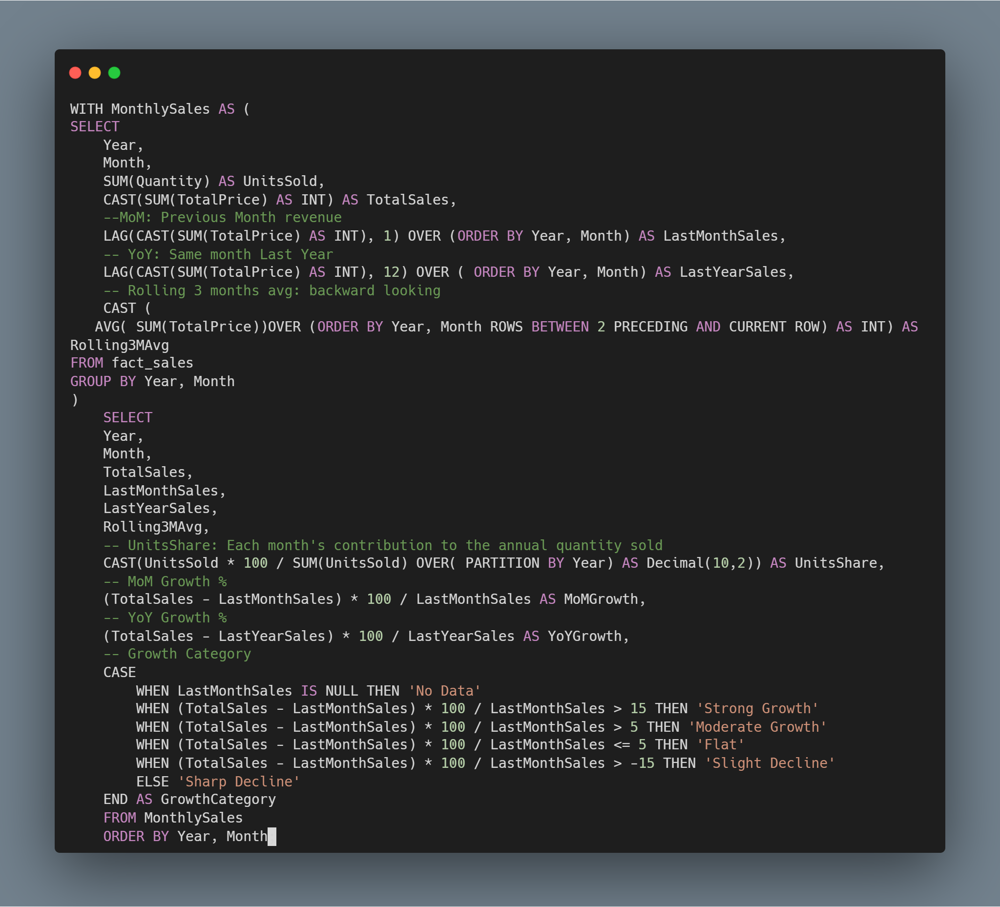
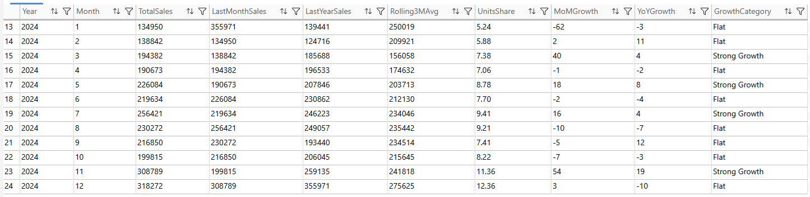

### High‑value and high‑risk customer segments 

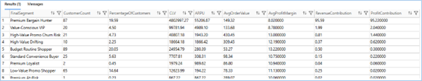

Across all customer segments, Premium Bargain Hunter, Value Conscious VIP, and High Value Promo Churn Risk customers represent only 32% of the total customer base, yet they generate an exceptional 98% of total company profit.
This confirms a strong Pareto effect: a small group of high value customers drives nearly all profitability.

### Reduce customer churn by 5% within 12 months 

### 📉 Monthly Retention Rate

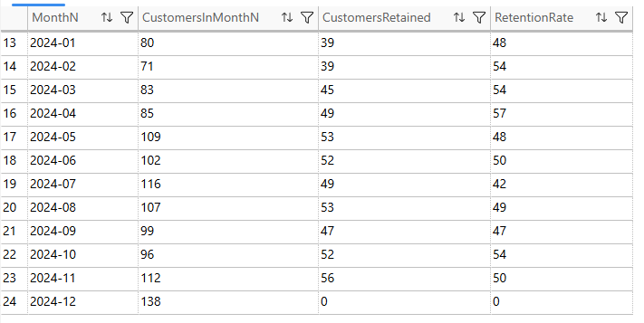

#### Churn At Risk Customer List
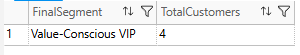

#### Churn Win-Back Customer List
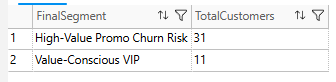

Monthly retention currently fluctuates around **50%**, meaning that half of customers do not return the following month. This highlights a significant opportunity to stabilise loyalty and reduce churn.
Within the top three high value customer segments, two priority groups emerge:

- **Churn At Risk (Recency 31–60 days):**
Customers who have not purchased in over a month but remain within a recoverable window.
This segment currently includes four high value customers who require targeted engagement to prevent full churn.

- **Churn	Win Back (Recency ≤ 30 days):**
High value customers who have recently lapsed and are most responsive to reactivation efforts.
These customers represent the quickest opportunity to lift retention and reduce churn.

Together, these insights provide a clear roadmap for targeted interventions that can meaningfully contribute to the goal of reducing churn by 5% within 12 months.

### Product Performance 

#### Product Category Performance
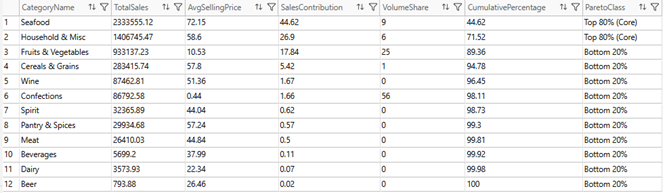

Category level Pareto analysis shows that revenue is highly concentrated: Seafood and Household & Misc together generate more than 71% of total sales, making them the core categories that drive overall business performance. Fruits & Vegetables serves as a mid tier support category, contributing high volume but only moderate revenue.
This distribution highlights three strategic priorities:
-	**Protect core categories** through strong stock availability, pricing control, and supplier reliability
-	**Leverage high volume support categories** like Fruits & Vegetables to drive cross sell and basket expansion
-	**Rationalise low impact categories** to optimise inventory, reduce carrying costs, and improve overall profitability

#### Product Performance: Order by SALES Contribution

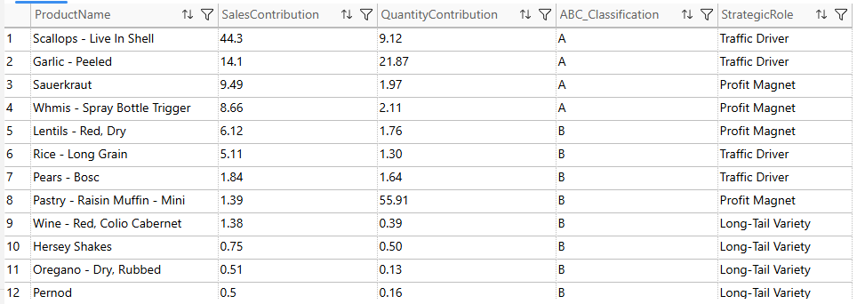

Product performance analysis ordered by sales contribution reveals a highly concentrated revenue structure. A tier products account for the majority of total sales and represent the core assortment that drives business performance. B tier products provide essential support by increasing basket size and enabling cross sell opportunities. C tier products contribute minimally and represent candidates for SKU rationalisation. This ABC classification provides a clear roadmap for inventory optimisation, pricing strategy, and promotional prioritisation.

#### Product Affinity: Top Segment (Premium Bargain Hunter)

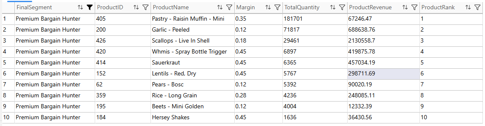

Product affinity analysis for the Premium Bargain Hunter segment highlights a small set of products that consistently drive both revenue and engagement. These items reveal strong loyalty, predictable buying patterns, and multi-category shopping behaviour.

#### Product Penetration: Top Segment (Premium Bargain Hunter)

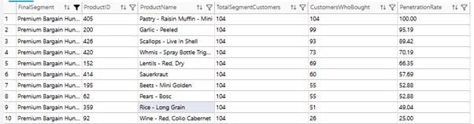

Sauerkraut’s penetration is 8.6% lower than Red Lentils, yet it generates roughly 50% more revenue. This indicates a high value product with strong spending behaviour among existing buyers. Because of this imbalance—low reach but high revenue—Sauerkraut represents a clear opportunity to increase penetration and drive incremental profit for the store.

####  Price Sensitivity Simulation
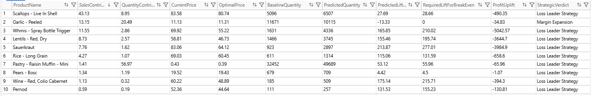

#### Market Basket Analysis
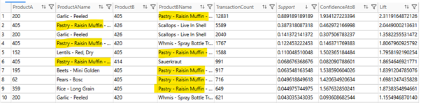

**Pastry – Raisin Muffin** stands out as a high‑velocity product: it represents only 1.41% of sales value but nearly 57% of total units sold, making it one of the strongest volume drivers in the store. Price‑elasticity modelling shows that a 9.3% price reduction would lift demand by 53%, adding roughly 17,237 extra units. The cost of doing so is very small—only £65.96 in margin.
Because this product appears in so many baskets, the margin reduction isn’t a loss; it’s a deliberate investment in traffic and basket growth. Customers who buy Raisin Muffins tend to buy other items alongside them, so increasing muffin volume increases overall store revenue, not just sales of the product itself. A small, controlled price adjustment on a high‑penetration item becomes a way to drive more visits, larger baskets, and stronger customer engagement across categories.

## 8. Recommendations

### 8.1 Invest in Pastry — Raisin Muffin as the Store’s Flagship Product
**Raisin Muffins** are a high‑velocity, high‑basket product. A small **9.3% price reduction** unlocks a **53% volume lift** at a cost of just **£65.96**, making this a high‑leverage pricing decision. Treating Raisin Muffins as a flagship product can increase store traffic, grow basket size, and lift overall revenue.

---

### 8.2 Strengthen Retention for High‑Value Customer Segments
High‑value customers drive a disproportionate share of revenue and require proactive retention.

**Actions**
- Build personalised retention journeys for the top three customer segments.
- Trigger alerts when high‑value customers reach **30+ days of inactivity**.
- Deploy targeted win‑back campaigns within the **31–60 day** window.

**Expected Impact**
- Lower churn among the most profitable customers.
- Higher repeat purchase frequency.
- Improved customer lifetime value.
- Direct contribution to the goal of **reducing churn by 5% within 12 months**.
---
### 8.3 Churn Reduction Action Plan

#### 1. Strengthen Early‑Stage Retention (First 30 Days)
Customers who do not return within the first month represent the largest source of churn.

**Actions**
- Create a structured **New Customer Pathway** with touchpoints at Day 7, Day 14, and Day 28.
- Offer a small incentive (e.g., free delivery or 5% off) to encourage the second purchase.

**Expected Impact**
Higher Month‑1 retention, reducing the number of customers entering the churn pipeline.

#### 2. Target High‑Value “Churn At‑Risk” Customers (Recency 31–60 Days)
These customers are still recoverable with timely intervention.

**Actions**
- Trigger automated alerts when a high‑value customer reaches **31 days of inactivity**.
- Send a personalised re‑engagement offer (e.g., discount on their favourite category).
- Use SMS or WhatsApp for higher visibility and faster response.
- Add a “We Miss You” Message with a clear call-to-action
  
**Expected Impact**
Prevents profitable customers from slipping into long‑term inactivity.

#### 3. Win Back Recently Lapsed Customers (Recency > 60 Days)
This group is the most responsive to reactivation efforts and offers quick retention gains.

**Actions**
- Launch a structured Win‑Back Campaign featuring:
  - personalised product bundles  
  - limited‑time offers  
  - reminders based on browsing or purchase history  
- Use A/B testing to identify the most effective incentive.
- Highlight new arrivals or best‑selling items to spark interest.

**Expected Impact**  
Immediate uplift in retention and a measurable reduction in churn.

---

### 8.4 Product Performance: Category Level

#### 1. Protect and Strengthen Core Categories (Seafood, Household & Misc)
These categories are essential revenue drivers and require consistent performance management.

**Actions**
- Review pricing and margin performance to maintain competitiveness without eroding profitability.
- Prioritise these categories in promotions, merchandising, and store placement.

**Expected Outcome**  
Stabilised revenue performance and reduced risk exposure from over‑dependence on core categories.

#### 2. Leverage Fruits & Vegetables as a High‑Volume Support Category
This category significantly contributes to customer traffic and basket size.

**Actions**
- Use Fruits & Vegetables as a cross‑sell anchor to increase basket value.

**Expected Impact**  
Higher basket value and improved cross‑category sales uplift.

---

### 8.5 Product Performance: Product Level

#### 1. Protect and Prioritise A‑Class Products (Top 80%)
These products are core revenue drivers and must be treated as high‑priority SKUs.

**Actions**
- Maintain high stock availability.
- Ensure price stability to avoid demand disruption.

**Expected Impact**  
Stable and predictable revenue performance.

#### 2. Leverage B‑Class Products for Cross‑Sell and Basket Growth
These products support incremental revenue and can be used to increase basket size.

#### 3. Rationalise C‑Class Products to Improve Efficiency
Low‑impact SKUs should be streamlined to reduce operational complexity and free up shelf space.

---

### 8.6 Inventory Optimisation
#### 📦 Inventory Planning:  Prioritise Items ABC Classification

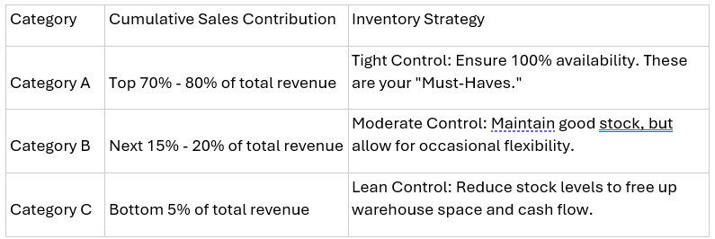

The ABC structure makes it clear that inventory investment should not be evenly distributed. Category A requires protection and precision, Category B requires balance, and Category C requires discipline. Optimising inventory along these lines improves service levels where it matters most, reduces waste where it matters least, and strengthens both profitability and operational efficiency. **Not all products deserve equal investment**.

### 8.7 Grow Penetration of High Value Opportunity Products
#### Position Sauerkraut as a Priority Growth Product
Sauerkraut shows 8.6% lower penetration than Red Lentils but generates around 50% more revenue, meaning each buyer spends more or buys more frequently. This makes it a high value item with strong upside potential if more customers adopt it. However, **promoting Sauerkraut wouldn’t complement many other products based on the market basket analysis.** 

Actions: 

•	Increase visibility

•	Targeted promotions

•	Cross-sell bundles

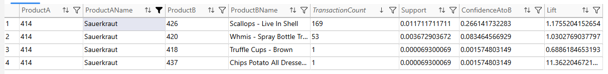
